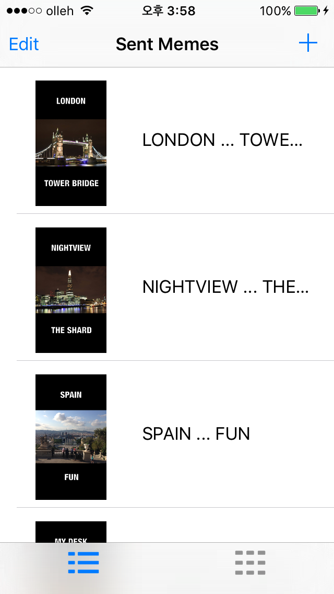
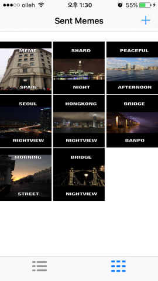
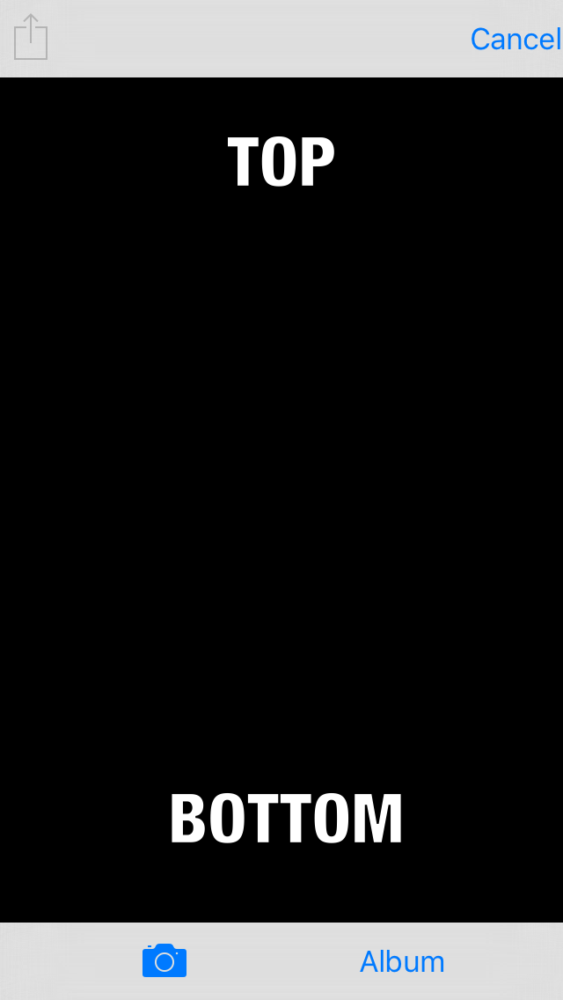
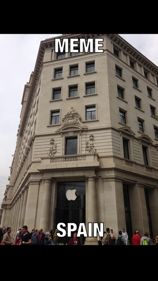
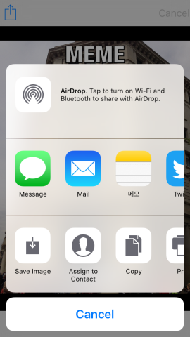
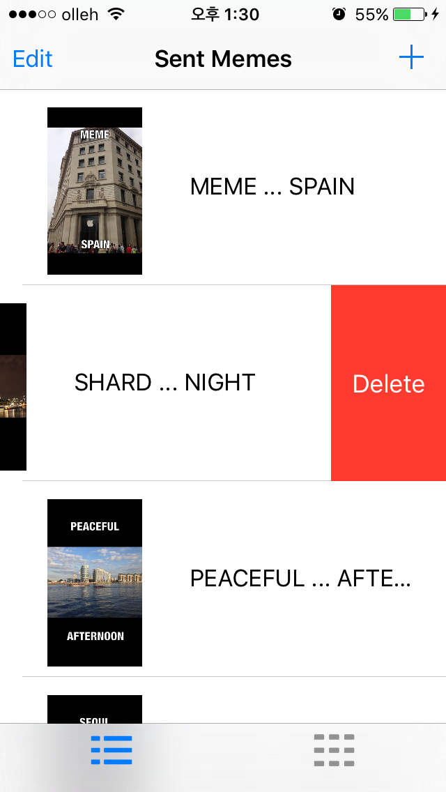

# MemeMe_version 2.0 
This app allows users to add texts to a selected picture from their phones. After editing a picture, users are able to share it via the text message or Social media such as Twitter or Facebook. Those pictures are permanatly saved in the application and can be seen in two diffrent styles of screens. 

# Features 

* When the application starts, meme images stored in the application are displayed. By tapping buttons at the bottom of the screen, the application presents images with a table or a grid style view.

 


* When users tap a '+' button in the top right-hand corner, the application change to a new screen with overlaid texts, 'TOP' and 'BOTTOM'. Users can select any picture from Photo album or Camera through buttons in the bottom of the screen in order to create their meme images. After select a picture, they can enter any message that they want to share with others. 




* As aforementioned, meme images can be shared via the built-in iphone function when users tap a share button in the top-left corner of the screen. There are several options that users can choose from such as Facebook, Twitter and so on. Users can also delete images with the swipe gesture in the picture list if they do not want to save the images.




# How to build 

1) Clone the repository 
```
$ git clone https://github.com/woogii/MemeMe_version2.git
$ cd MemeMe_version2
```
2) Open the workspace in XCode 
```
$ open MemeMe_version2.xcodeproj/
```

3) Compile and run the app in your simulator 

# Compatibility 
The code of this project works in Swift2.0, Xcode 7.0 and iOS9 


